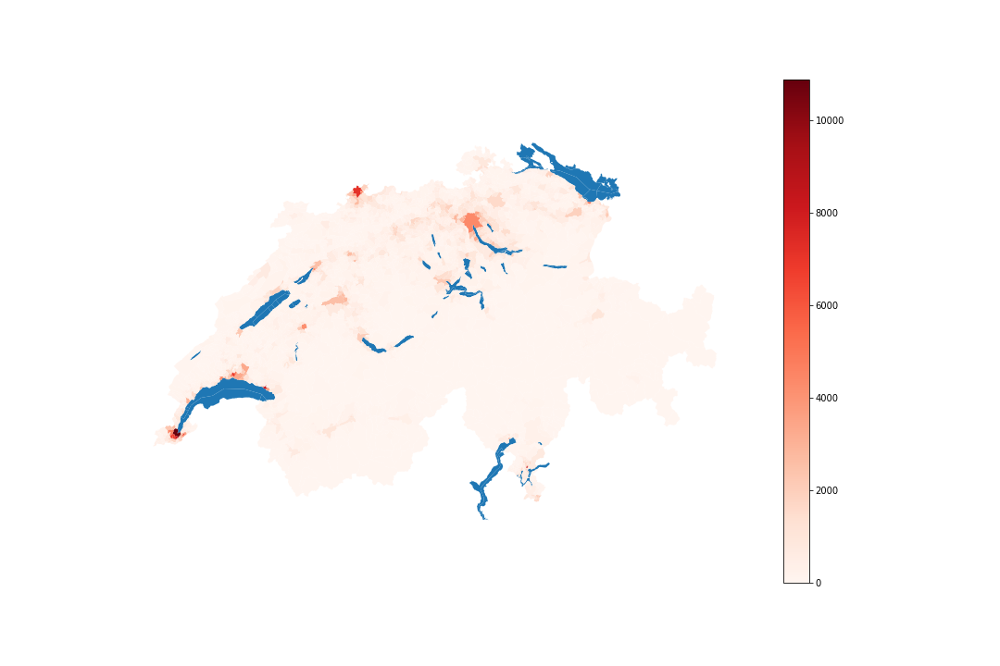
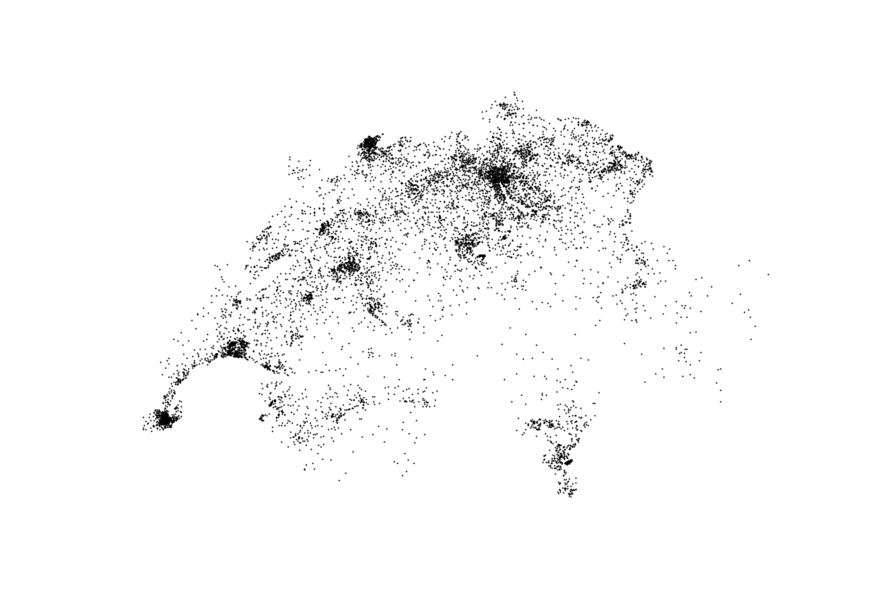

# Swiss-population-density-map

A simple and short jupyter notebook to create a population density map with shape file data from the swiss federal Office of Topography
This data is available online (https://shop.swisstopo.admin.ch/en/products/landscape/boundaries3D) but the main files have been included in the swiss_shp.zip file.

The 'swiss_map2.ipynb' notebook is the updated version using the geopandas library. The 'Swiss_population_map.ipynd' notebook is the oledr version without geopandas.

# Results:

Population map density from every region:

Population dot-map (every dot represent 1000 people):

